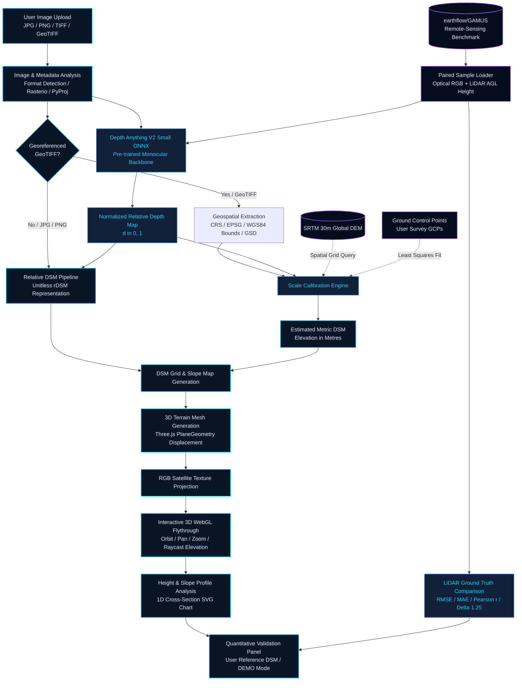

# DepthWizard – Single-View Height Estimation and 3D Flythrough

**Smart India Hackathon 2026 Prototype**  
**Problem Statement ID:** SIH26175  
**Organization:** Indian Space Research Organisation (ISRO), Department of Space  

---

## 1. Project Title
**DepthWizard: Single-View Height Estimation and Interactive 3D Terrain Flythrough from Optical Remote-Sensing Imagery**

---

## 2. Problem Statement (SIH26175)
Traditional digital surface modeling and 3D terrain reconstruction from spaceborne optical sensors conventionally require **multi-view stereo imagery** (along-track or across-track stereo pairs) or active sensing payloads (such as LiDAR and InSAR). However, vast archives of satellite imagery exist only as **single-view (monocular) optical acquisitions**.

**SIH26175 Objective:**  
Develop an automated, reliable system capable of:
1. Ingesting single-view optical RGB remote-sensing imagery (JPG, PNG, TIFF, GeoTIFF).
2. Predicting dense relative depth / height representations using monocular deep-learning foundation backbones.
3. Ingesting spatial metadata and anchoring relative depth to real-world metric elevation using digital elevation reference data (e.g., SRTM 30m Global DEM) or Ground Control Points (GCPs).
4. Generating Digital Surface Models (DSM / rDSM) and surface slope analysis grids.
5. Reconstructing interactive 3D terrain environments in-browser with satellite texture draping and flythrough capabilities.
6. Providing rigorous, un-fabricated validation against real remote-sensing elevation benchmarks (such as `earthflow/GAMUS`).

---

## 3. Background
Accurate height and elevation models are essential for ISRO's civilian and strategic applications, including:
- **Disaster Response & Flood Modeling:** Inundation simulation and coastal vulnerability assessment.
- **Urban Planning & Infrastructure Development:** 3D building morphology and sprawl analysis.
- **Geomorphology & Terrain Analysis:** Landslide hazard assessment, watershed modeling, and slope stability.
- **Defense & Strategic Surveillance:** Line-of-sight analysis and mission planning from legacy monocular reconnaissance data.

While LiDAR produces high-precision elevation, it is resource-intensive and restricted in coverage. Monocular deep-learning height estimation bridges this gap by extracting surface relief, building heights, and topographic contours from ubiquitous single-frame optical sensors.

---

## 4. Our Proposed Solution
**DepthWizard** implements a modular, scientifically rigorous end-to-end framework:
1. **Pre-trained Monocular Backbone:** Leverages **Depth Anything V2 Small (Quantized ONNX)** for fast, CPU-efficient zero-shot relative depth estimation.
2. **Dual Pipeline Architecture:**
   - **Relative Mode (rDSM):** For standard non-georeferenced images (JPG/PNG), generating unitless relative surface relief without asserting false metric claims.
   - **Metric Calibration Mode (Metric DSM):** For georeferenced GeoTIFFs, extracting coordinate reference systems (CRS) and bounding boxes to anchor relative depth against coarse **SRTM 30m Global DEM** grids or user-provided **Ground Control Points (GCPs)**.
3. **Interactive 3D WebGL Engine:** Utilizes Three.js for real-time terrain displacement, RGB texture draping, slope-gradient visualization, elevation point inspection, and auto-orbit flythroughs.
4. **Transparent Validation Engine:** Evaluates predictions against user ground-truth files and the **earthflow/GAMUS** airborne LiDAR benchmark dataset, outputting genuine RMSE, MAE, Pearson $r$, and threshold metrics with zero data fabrication.

---

## 5. Core Objectives
- [x] Ingest JPG, PNG, TIFF, and georeferenced GeoTIFF images.
- [x] Compute zero-shot monocular relative depth maps in real time on CPU.
- [x] Extract full geospatial metadata (CRS, EPSG, Affine Transform, Projected & WGS84 Extents, Ground Sampling Distance).
- [x] Implement least-squares scale & offset anchoring against SRTM 30m DEM and Ground Control Points.
- [x] Generate standardized Digital Surface Models (DSM) and slope angle maps ($0^\circ - 90^\circ$).
- [x] Render real-time 3D terrain meshes in WebGL with texture mapping and raycasting elevation readouts.
- [x] Enable 1D cross-section elevation profile analysis.
- [x] Integrate live quantitative benchmarking against the **earthflow/GAMUS** dataset.

---

## 6. End-to-End System Architecture



---

## 7. Input Handling

### Non-Georeferenced Imagery (JPG / PNG / Standard TIFF)
- Ingested via PIL image decoders.
- Surface morphology is extracted as a **Relative Digital Surface Model (rDSM)**.
- Pixel values represent unitless relative elevation ($0.0 = \text{lowest visible surface}$, $1.0 = \text{highest visible structure}$).
- The system explicitly labels these outputs as **RELATIVE / UNCALIBRATED** and disclaims metric scale.

### Georeferenced Imagery (GeoTIFF)
- Ingested using `rasterio` and `pyproj`.
- Automatically extracts:
  - **Coordinate Reference System (CRS)** and **EPSG Code**.
  - **Affine Geotransform Matrix** ($[a, b, c, d, e, f]$).
  - **Projected Coordinate Extents** and **WGS84 Geographic Extents** ($\text{Lat/Lon}$).
  - **Ground Sampling Distance (GSD)** in metres/pixel.
- Retains full geospatial context for scale anchoring and metric DSM export.

---

## 8. Monocular Depth Estimation
DepthWizard utilizes **Depth Anything V2 Small** exported to **INT8 Quantized ONNX** (`onnx-community/depth-anything-v2-small`):
- **Pretrained Foundation Backbone:** Provides robust relative depth priors across diverse surface structures.
- **Input Preprocessing:** Images are resized to $518 \times 518$ (canonical patch multiple), normalized with ImageNet statistics ($\mu = [0.485, 0.456, 0.406]$, $\sigma = [0.229, 0.224, 0.225]$).
- **Execution Provider:** Optimized for standard multi-core **CPU execution** (~0.7s inference latency per image), ensuring universal hackathon/field deployability without dedicated GPUs.
- **Output:** Dense single-channel floating point disparity grid resized back to original native dimensions and normalized to $[0, 1]$.

---

## 9. GAMUS Dataset Integration
To ensure research credibility and provide objective evaluation on real remote-sensing overhead data, DepthWizard integrates the **earthflow/GAMUS** dataset:

```python
from datasets import load_dataset
ds = load_dataset("earthflow/GAMUS")
```

### Dataset Structure & Modalities:
`earthflow/GAMUS` provides paired high-resolution satellite imagery across urban, suburban, and commercial landscapes:
- `images/`: High-resolution $(1024 \times 1024 \times 3)$ overhead optical RGB imagery.
- `heights/`: True airborne **LiDAR Above-Ground-Level (AGL) height maps** ($(1024 \times 1024)$ float in metres).
- `classes/`: Semantic landcover and building segmentation masks.

> **Note on Training Provenance:**  
> DepthWizard utilizes Depth Anything V2 as a **pre-trained zero-shot backbone** and uses GAMUS as a **real benchmark and evaluation testbed**. We do not claim to have trained Depth Anything V2 from scratch.

---

## 10. Remote-Sensing Domain Gap
Standard vision depth foundation models (MiDaS, Depth Anything, DPT) are primarily trained on ground-level perspective photographs (indoor rooms, autonomous driving, streetscapes) characterized by:
- Central perspective projection and distinct horizontal horizon lines.
- Continuous ground planes expanding from bottom to top.
- Clear vanishing points.

In contrast, **remote-sensing orbital imagery** features:
- Near-nadir orthogonal (affine) geometry with no horizon.
- Scale invariance dictated by sensor Ground Sampling Distance (GSD).
- Abrupt vertical relief (building walls, towers, terrain declivities).
- Complex shadows and seasonal sun-angle variations.

DepthWizard addresses this domain gap by using relative foundation features to capture relative surface gradients and building boundaries, while relying on **external DEMs (SRTM) or GCPs to calibrate scale and vertical offset**.

---

## 11. Scale Calibration

Scale calibration establishes a mapping between unitless relative height ($z_{\text{rel}} = 1.0 - d$) and true metric elevation ($z_{\text{metric}}$):

$$z_{\text{metric}} = a \cdot z_{\text{rel}} + b$$

Where:
- $a$: Metric scaling factor ($\text{metres}$).
- $b$: Base vertical elevation offset ($\text{metres above MSL}$).

### Calibration Methods:
1. **SRTM 30m Global DEM Anchoring (Automated):**
   - For georeferenced GeoTIFFs, the system samples a spatial grid across the WGS84 geographic bounding box.
   - Real elevations are fetched and bilinearly interpolated to scene dimensions.
   - A linear least-squares regression fits $a$ and $b$, computing calibration residual RMSE.
2. **Ground Control Points (GCP) Calibration (Interactive):**
   - User inputs $\ge 2$ known reference points: $\left(X_i, Y_i, Z_i^{\text{known}}\right)$.
   - Solves the overdetermined system $A \mathbf{c} = \mathbf{z}$ via least-squares:
     $$\begin{bmatrix} z_{\text{rel}, 1} & 1 \\ z_{\text{rel}, 2} & 1 \\ \vdots & \vdots \\ z_{\text{rel}, N} & 1 \end{bmatrix} \begin{bmatrix} a \\ b \end{bmatrix} = \begin{bmatrix} Z_1^{\text{known}} \\ Z_2^{\text{known}} \\ \vdots \\ Z_N^{\text{known}} \end{bmatrix}$$
   - Reports fitted parameters, individual point residuals ($e_i = Z_i - \hat{Z}_i$), and $\text{RMSE}_{\text{GCP}}$.

---

## 12. DSM Generation
The Digital Surface Model (DSM) captures both the bare earth terrain and elevated features (buildings, trees, infrastructure):
- **Relative DSM (rDSM):** Output values in $[0.0, 1.0]$ representing normalized height index.
- **Metric DSM:** Output values in true metres.
- **Slope Angle Computation:** Evaluated via central finite differences:
  $$\text{Slope} = \arctan\left(\frac{\sqrt{\left(\frac{\partial z}{\partial x}\right)^2 + \left(\frac{\partial z}{\partial y}\right)^2}}{\text{GSD}}\right) \times \frac{180}{\pi}$$
- **Visualization:** Colorized using **Viridis** (elevation: purple $\to$ green $\to$ yellow) and **Magma** (slope: black $\to$ magenta $\to$ yellow).

---

## 13. 3D Terrain Mesh Generation
- **Geometry:** Three.js `PlaneGeometry` with adaptive subdivision ($w-1 \times h-1$ vertices, downsampled to max $256 \times 256$ for fluid 60 FPS WebGL rendering).
- **Displacement:** Per-vertex elevation mapping along the $Y$-axis:
  $$Y_{i, j} = z_{\text{norm}}(i, j) \times \text{HeightScale}$$
- **Surface Normals:** Analytically recomputed on vertex displacement to ensure realistic solar shading and specular highlights.

---

## 14. RGB Texture Projection
- The original optical satellite image (or colorized DSM/slope map) is loaded as a WebGL texture with `ClampToEdgeWrapping` and anisotropic filtering.
- Orthogonal UV texture mapping drapes the optical imagery over the displaced 3D terrain surface, providing an intuitive, photo-realistic satellite digital twin.

---

## 15. Interactive 3D Flythrough
- **Camera Controls:** Three.js `OrbitControls` with smooth damping ($\text{factor} = 0.08$), polar angle constraints, and zoom limits.
- **Auto-Orbit Mode:** Continuous automated flythrough simulation orbiting the scene center at adjustable speeds.
- **Wireframe Mode:** Toggleable wireframe overlay displaying underlying TIN/grid topology.
- **Elevation Point Inspection (Raycasting):** Interactive mouse hover/click casts a 3D ray onto the terrain mesh and extracts precise elevation at the intersected coordinates.
- **Vertical Exaggeration:** Dynamic visual multiplier ($1\times - 5\times$) for visualization clarity, strictly isolated so it never modifies underlying metric data.

---

## 16. Height and Slope Analysis
- **Scene Statistics:** Min, Max, Mean, Standard Deviation, and Elevation Range.
- **Slope Distribution:** Minimum, Maximum, and Mean slope in degrees ($^\circ$).
- **1D Elevation Cross-Section:** Real-time spatial sampling along diagonal or user-selected transects, rendered as an SVG line chart with gradient area fill and metric coordinate axes.

---

## 17. Validation & Accuracy Assessment
DepthWizard implements genuine, verifiable accuracy assessment metrics:

1. **Root Mean Square Error (RMSE):**
   $$\text{RMSE} = \sqrt{\frac{1}{N} \sum_{i=1}^N \left(\hat{z}_i - z_i\right)^2}$$
2. **Mean Absolute Error (MAE):**
   $$\text{MAE} = \frac{1}{N} \sum_{i=1}^N \left|\hat{z}_i - z_i\right|$$
3. **Pearson Correlation Coefficient ($r$):**
   $$r = \frac{\sum_{i=1}^N \left(\hat{z}_i - \bar{\hat{z}}\right)\left(z_i - \bar{z}\right)}{\sqrt{\sum_{i=1}^N \left(\hat{z}_i - \bar{\hat{z}}\right)^2 \sum_{i=1}^N \left(z_i - \bar{z}\right)^2}}$$
4. **Threshold Accuracy ($\delta < 1.25$):**
   $$\% \text{ of pixels satisfying } \max\left(\frac{\hat{z}_i}{z_i}, \frac{z_i}{\hat{z}_i}\right) < 1.25$$

> **Zero Fabrication Policy:**  
> When no ground-truth reference DSM is uploaded by the user, metrics are explicitly marked as **N/A / Demonstration Mode**. Synthetic or random numbers are never displayed as real evaluation metrics.

---

## 18. Two Processing Pipelines

### Pipeline A: Non-Georeferenced (JPG / PNG)
$$\text{Optical Image} \longrightarrow \text{Depth Anything V2} \longrightarrow \text{Relative Depth Map} \longrightarrow \text{Relative DSM (rDSM)} \longrightarrow \text{3D WebGL Visualization}$$

### Pipeline B: Georeferenced (GeoTIFF)
$$\text{GeoTIFF} \longrightarrow \text{CRS \& Extents} \longrightarrow \text{Depth Anything V2} \longrightarrow \text{Relative Depth} \longrightarrow \text{SRTM / GCP Calibration} \longrightarrow \text{Metric DSM (m)} \longrightarrow \text{3D Flythrough \& Validation}$$

---

## 19. Technology Stack

### Backend
- **Language:** Python 3.13+
- **Web Framework:** Flask 3.1, Flask-CORS
- **AI Inference Engine:** ONNX Runtime 1.29 (CPU Execution Provider)
- **Foundation Model:** Depth Anything V2 Small INT8 Quantized (`onnx-community/depth-anything-v2-small`)
- **Geospatial Processing:** `rasterio`, `pyproj`, `affine`
- **Scientific Computing & Datasets:** `numpy`, `scipy`, `datasets`, `h5py`, `pillow`

### Frontend
- **Framework:** React 19, TypeScript
- **Bundler & Dev Server:** Vite 8.2
- **3D Graphics:** Three.js (WebGL, ACES Filmic Tone Mapping, OrbitControls)
- **UI & Styling:** Custom ISRO Dark Scientific CSS System, Lucide React Icons

---

## 20. Project Structure

```
DepthWizard/
├── README.md                        # Project documentation & architecture
├── start.bat                        # One-click Windows launch script
├── backend/
│   ├── app.py                       # Flask REST API routes
│   ├── requirements.txt             # Python backend dependencies
│   ├── models/                      # Cached ONNX depth model
│   ├── uploads/ & outputs/          # Session file storage
│   └── modules/
│       ├── __init__.py
│       ├── image_analysis.py        # Rasterio & PIL metadata extraction
│       ├── depth_estimation.py      # ONNX monocular depth inference
│       ├── dsm_generation.py        # DSM & slope generation, colormaps
│       ├── calibration.py           # SRTM DEM & GCP least-squares calibration
│       └── validation.py            # GAMUS benchmark & validation metrics
└── frontend/
    ├── index.html                   # HTML entry point
    ├── package.json                 # Frontend dependencies
    ├── vite.config.ts               # Vite configuration
    ├── tsconfig.json                # TypeScript configuration
    └── src/
        ├── main.tsx                 # React DOM root
        ├── App.tsx                  # Master routing shell
        ├── index.css                # Global ISRO scientific design theme
        ├── api/
        │   └── client.ts            # Typed Axios backend API client
        ├── store/
        │   └── AppContext.tsx       # Global workflow state management
        ├── components/
        │   ├── StepNav.tsx          # Step navigation sidebar
        │   ├── StepNav.module.css
        │   └── TerrainViewer.tsx    # Three.js 3D WebGL terrain viewer
        └── pages/
            ├── LandingPage.tsx      # Drag-and-drop upload screen
            ├── ImageAnalysisPage.tsx# Geospatial metadata display
            ├── DepthEstimationPage.tsx # Monocular inference & depth map
            ├── DSMGenerationPage.tsx# DSM elevation & slope map
            ├── ScaleCalibrationPage.tsx# SRTM & GCP calibration tools
            ├── TerrainViewerPage.tsx# 3D terrain flythrough & inspect
            ├── HeightAnalysisPage.tsx# Cross-section profile chart
            ├── ValidationPage.tsx   # User validation & GAMUS benchmark
            └── StepPage.module.css  # Shared step styles
```

---

## 21. Installation

### Prerequisites
- **Node.js:** v18.0 or later (v24+ recommended)
- **Python:** v3.10 or later (v3.13 tested)
- **Git**

### Backend Setup
```bash
cd backend
python -m pip install --upgrade pip
pip install -r requirements.txt
```

### Frontend Setup
```bash
cd frontend
npm install
```

---

## 22. Usage

### Quick Launch (Windows)
Double-click `start.bat` in the project root directory.

### Manual Launch
1. **Start Backend:**
   ```bash
   cd backend
   python app.py
   ```
   *Backend runs on `http://127.0.0.1:5000`.*

2. **Start Frontend:**
   ```bash
   cd frontend
   npm run dev
   ```
   *Frontend opens on `http://localhost:5173`.*

---

## 23. Expected Output
- **Step 01 (Analysis):** Verified spatial metadata (CRS, EPSG, resolution, bounds).
- **Step 02 (Depth):** Dense relative depth map with Turbo colorization.
- **Step 03 (DSM):** Surface elevation grid and slope map (Viridis/Magma).
- **Step 04 (Calibration):** SRTM DEM or GCP scale fit with residual reporting.
- **Step 05 (3D View):** Interactive WebGL terrain with satellite texture draping.
- **Step 06 (Profile):** 1D elevation cross-section line chart.
- **Step 07 (Validation):** Real quantitative RMSE/MAE metrics against reference datasets and GAMUS LiDAR benchmarks.

---

## 24. Limitations
1. **Single-View Inherent Ambiguity:** Single-image height estimation is mathematically ill-posed; relative depths are inferred from appearance priors, lighting, and textures rather than direct geometric parallax.
2. **Coarse SRTM Resolution:** SRTM 30m provides a regional macro-topographic anchor but cannot resolve individual building heights or fine urban structures.
3. **Overhead Domain Gap:** Pretrained foundation models may exhibit uncertainty on flat rooftops or complex cast shadows.
4. **Accuracy Verification:** Monocular estimates must always be treated as **Estimated Metric Elevations** and validated against LiDAR or GCP survey data before engineering use.

---

## 25. Future Scope
- **Domain Fine-Tuning:** Fine-tuning Depth Anything V2 on remote-sensing aerial/satellite datasets (GAMUS, SpaceNet 7, DFC2019).
- **High-Resolution DEM Integration:** Integrating CartoDEM (ISRO) or Copernicus 30m GLO-30 for higher-accuracy scale anchoring.
- **Shadow-Geometry Coupling:** Combining monocular depth features with solar elevation/azimuth shadow analysis for refined building height estimation.
- **Direct GeoTIFF 32-bit Float Export:** Native export of calibrated DSMs to GIS-standard 32-bit floating-point GeoTIFF format.

---

## 26. Conclusion
**DepthWizard** provides a comprehensive, working SIH26175 prototype for ISRO, transforming monocular optical remote-sensing imagery into calibrated Digital Surface Models and interactive 3D terrain environments. By combining zero-shot deep learning backbones with geospatial anchoring, WebGL 3D rendering, and transparent ground-truth benchmarking on `earthflow/GAMUS`, DepthWizard delivers a technically credible foundation for next-generation single-view Earth Observation analysis.
